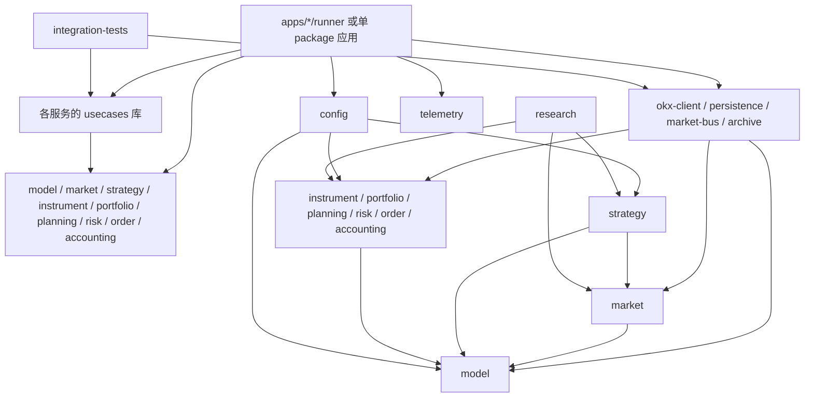
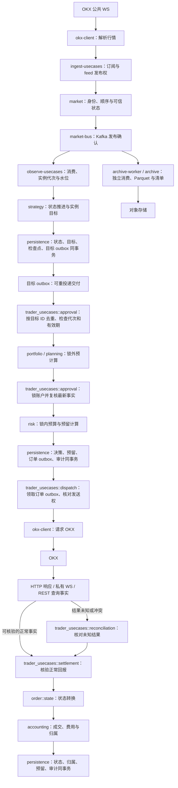

# okx-trading 架构与功能归属

状态：设计草案。本文定义 Rust 实现的能力、模块职责和验收边界。Python 版本可作为已有功能和行为的参考，不要求兼容其源码、命令、配置或数据库。首个验证环境使用少量产品和策略；产品、策略实例及账户数量由配置和容量验收决定，不写死在业务代码中。

配套文档：[开发任务总表](development-roadmap.md)、[技术决策](technology-decisions.md)、[性能与容量设计](performance-and-capacity.md)、[Docker Compose 部署约定](compose-deployment.md)、[配置与观测规范](configuration-and-observability.md)、[产品与策略身份及绑定](product-strategy-model.md)、[策略目标与实例执行协议](strategy-target-and-execution.md)、[契约与不变量](contracts-and-invariants.md)、[行情事件身份与采集接管](market-event-identity.md)、[实施协议](implementation-protocols.md)、[故障边界与恢复](failure-and-recovery.md)、[测试与验收策略](testing-strategy.md)、[模块文档规范](module-documentation.md)、[OKX 官方 API 依据](okx-api-reference.md)。

## Python 版本参考边界

可查阅 [Python 迁移交接文档](../../okx-trading-py/docs/rust-migration-guide.md)、实际源码和测试，提取已实现功能、业务不变量、边界输入、失败场景及尚未通过的验收项。交接文档的状态描述需要用实际源码和测试核对；Python 中仅有设计或技术探针的功能，不视为 Rust 系统已实现或可自动交易。交易所接口行为还须以 [OKX 官方 API 依据](okx-api-reference.md)及模拟盘验证为准。

Rust 的生产代码和测试代码均重新编写，遵循本文的 `crates/`、`apps/` 所有权、用例与端口边界，以及技术决策、实施协议和工程质量门禁。不得将 Python 代码直接搬入仓库、逐行翻译，或照搬其 package、数据库、队列和进程组织。实现前为每项要保留的功能记录“Python 行为/证据 -> Rust 所属模块与契约 -> Rust 验收测试”；差异和有意舍弃的旧行为须明确记录，不能把旧程序输出直接作为唯一正确性依据。核对方式见 [测试与验收策略](testing-strategy.md#python-功能参考与验收)。

## 范围与关键约束

- 同一账户可同时管理多个 SPOT 和 USDT 本位线性 SWAP；每产品可运行多个独立策略实例。内部产品、OKX 产品、策略类型与策略实例分别有稳定身份和版本，关系由配置显式声明。
- 支持 `net_mode` 与 `long_short_mode`。双向仓位、保证金、毛敞口、预留和策略归属按侧别计算，不因净额相抵而消失。
- 行情采集、归档、观察可分布在多台机器。订单批准和发送按账户单活；不同账户可由不同执行者并行处理。
- OKX 是余额、仓位、订单和成交的远端事实来源；PostgreSQL 保存本地策略归属、决策、预留、订单、成交和 outbox。Kafka 仅承载行情与非权威观察事件。
- 市场或账户事实缺失、过期、冲突时暂停受影响的新开仓。未知提交结果先按固定 `clOrdId` 查询；不得盲目重发。
- 初版只接 OKX 模拟盘。实盘、交割、币本位合约和自动切换账户持仓模式均不在范围内。

## 技术基线

| 领域 | 选择 | 责任边界 |
| --- | --- | --- |
| 异步执行 | Tokio | 任务监督、有界队列、取消、超时；纯业务计算保持同步。 |
| 行情日志 | Kafka 集群、`rdkafka` | 按产品 ID 分区；发布确认、手动位点、消费者重平衡。没有跨分区全局顺序。 |
| 事务账本与采集协调 | PostgreSQL、SQLx | 账户行锁、唯一约束、原子批准、预留、outbox、恢复检查点及受限权限的 feed 发布权代次。 |
| 精确数值 | `BigDecimal` 加领域包装类型 | 明确币种、数量单位、最大精度、舍入和溢出规则；交易金额不用浮点数。 |
| OKX 网络 | `reqwest`、`tokio-tungstenite` | REST 签名与限速、WS 连接与重连；协议适配器不做交易决策。 |
| 历史数据 | Arrow/Parquet、S3 兼容对象存储 | 不可变归档对象、清单与回放；消费者可重放。 |
| 研究查询 | DataFusion | 查询归档与离线研究，不进入在线订单关键路径。 |
| 可观测性 | `tracing`、`tracing-subscriber`、指标、健康接口 | 结构化标准输出与低基数指标；审计记录单独持久化。 |

首个本机验证环境用 Docker Compose 启动 PostgreSQL、Kafka、对象存储及应用容器；宿主机不原生安装这些服务。多机部署可在各主机使用 Compose 管理容器，但生产环境仍需要高可用 PostgreSQL、跨故障域的 Kafka 副本以及持久对象存储。具体副本数、保留期和容量上限由故障与负载测试确定，不从初始产品数推算。详见 [部署约定](compose-deployment.md)。

## Workspace 边界

```text
okx-trading/
  README.md          项目入口、构建/验证命令与文档索引（计划）
  Cargo.toml         虚拟 workspace：显式 members、resolver、共享依赖与 lint
  Cargo.lock
  rust-toolchain.toml
  rustfmt.toml       格式化约定（计划）
  deny.toml          依赖许可证/公告规则（计划）
  .gitignore         排除本地 env、密钥和临时运行数据
  .github/
    workflows/
      ci.yml         workspace lint、测试与文档门禁（计划）
  config/
    README.md        配置来源、发布和模板说明
    env.example      非敏感部署变量模板；不承载交易权限开关
    example.toml     可解析的非敏感业务配置（配置 schema 冻结后创建）
  deploy/
    compose/
      README.md      Compose 落地顺序与目录说明
      compose.yaml   计划：本机服务、网络、卷及健康检查（尚未创建）
    docker/
      Dockerfile     可复现的应用镜像构建（计划）
  crates/
    model/             跨链路身份、单位、版本与最小事实契约
    market/            行情事件身份、顺序、可信状态
    strategy/          策略接口、实例状态、预热及目标生成
    instrument/        产品映射、规格与账户许可规则
    portfolio/         策略目标合并、冲突与实例份额
    planning/          SPOT/SWAP 订单候选、取整与交易条件
    risk/              账户/产品/实例额度与预留计算
    order/             订单身份与状态转换规则
    accounting/        成交、费用与策略库存归属计算
    config/            配置解析、交叉校验和版本
    telemetry/         进程日志/指标初始化及公共字段约定
    okx-client/        OKX REST、公共/业务/私有 WS
    persistence/
      Cargo.toml
      src/lib.rs      PostgreSQL 账本与事务适配
      migrations/     有序 SQL 迁移（计划）
    market-bus/        Kafka 发布、消费和位点协议
    archive/           Parquet、对象存储和清单
    research/          确定性回放、收益与容量分析
  apps/
    ingest/
      usecases/
        Cargo.toml
        src/lib.rs       订阅、feed 所有权与发布进度用例
        src/ports.rs     采集用例所需外部能力
      runner/
        Cargo.toml
        src/main.rs      配置、适配器包装与采集进程启动
    observe/
      usecases/
        Cargo.toml
        src/lib.rs       实例所有权、输入水位与目标提交用例
        src/ports.rs     观察用例所需外部能力
      runner/
        Cargo.toml
        src/main.rs      配置、适配器包装与观察进程启动
    trader/
      usecases/
        Cargo.toml
        src/lib.rs       批准、发送、对账、入账与接管用例
        src/ports.rs     交易用例所需外部能力
      runner/
        Cargo.toml
        src/main.rs      配置、适配器包装与账户执行进程启动
    archive-worker/
      Cargo.toml
      src/main.rs     独立消费、归档与进度提交
    notifier/
      Cargo.toml
      src/main.rs     告警投递、重试与确认
    admin/
      Cargo.toml
      src/main.rs     运维 CLI：配置发布/回退、暂停/恢复与维护命令
  integration-tests/
    Cargo.toml        跨进程/跨基础设施测试 package
    src/lib.rs
    tests/            PG、Kafka、对象存储与服务交接测试
    fixtures/         脱敏且版本化的协议样本
  docs/                架构、技术决策、契约、OKX API、测试、容量与恢复文档
```

上图是**目标目录**，不是当前磁盘快照。当前已有根虚拟 workspace、`crates/model`、`crates/config`、`crates/telemetry`、`integration-tests`、`deploy/compose/compose.yaml` 和文档配置；其余条目按任务创建。可运行 Cargo 检查及基础设施 Compose，但尚无可启动的 Rust 应用。每个未逐项展开的 `crates/*` 也是标准库 package，至少有 `Cargo.toml` 与 `src/lib.rs`；每个 `apps/*/runner` 和单 package 应用有 `src/main.rs`。所有 package 在创建时增加自己的 `README.md`，每个实际实现的 Rust module 维护 `//!` 文档，规则见 [模块文档规范](module-documentation.md)。`src/ports.rs` 是所属 `usecases` 库的 module，不是独立 package。根 `Cargo.toml` 的 `[workspace].members` 显式列出所有已实现的嵌套 package，根目录不设 `[package]` 或 `src/main.rs`。

`crates/` 收纳离开某个进程仍有独立含义的领域规则、跨应用契约和基础设施适配器；`apps/` 收纳可部署进程及其专属用例。两者都是 workspace package 的位置，不限定 Cargo package 是库还是二进制。只有出现明确的复用、依赖隔离或部署边界时才新增 package，单一职责主要由 package 内的 module 保证。`model` 只保存跨链路稳定的身份、单位、版本和最小不可变事实契约；`market` 处理已解析行情；`strategy` 维护实例算法状态和目标。交易领域按变化原因拆为 `instrument`（规格和许可）、`portfolio`（目标合并和份额）、`planning`（候选与取整）、`risk`（额度和预留）、`order`（订单身份与状态）及 `accounting`（成交和库存归属）；各 crate 内仍按 SPOT/SWAP 或用例分 module。`apps/ingest`、`apps/observe`、`apps/trader` 各自包含一个专属 `usecases` 库 package 和一个 `runner` binary package；`usecases/src/ports.rs` 定义该应用需要的外部能力，不建立全局 `ports` crate。`trader_usecases` 内的批准、发送、对账、入账和接管是独立 module。`persistence` 负责读取一致事实与原子保存，不制定交易政策；`okx-client` 解析 OKX 报文并负责请求/订阅；`config` 校验配置而不决定交易权限；`telemetry` 不保存审计事实。三个 `runner` 负责启动、关闭、配置及依赖组装；较小的归档、通知、管理应用初版各用一个 binary package，逻辑增长或需要独立复用时再提取库 package。

`apps/admin` 初版是运维 CLI，不承载实时交易链路。它校验操作者权限、发起配置发布/回退、交易暂停/恢复以及数据维护和恢复命令，并记录操作审计；恢复交易仍须由所属用例核验事实和完成状态转换。它不自行计算风险、修改订单状态或绕过交易用例的门禁。

每个 `crates/*`、三组 `apps/<role>/usecases` 与 `apps/<role>/runner`、`apps/archive-worker`、`apps/notifier`、`apps/admin` 以及 `integration-tests` 都是独立 Cargo package，有自己的 `Cargo.toml` 与 `src/`。三组库 package 分别命名为 `ingest-usecases`、`observe-usecases`、`trader-usecases`，binary package 分别命名为 `ingest-runner`、`observe-runner`、`trader-runner`；最终可执行文件名在各自 manifest 中明确声明。单元测试放在所属 module 的 `#[cfg(test)]` 中，集成测试放在所属 package 的 `tests/` 中。根目录不放无所属 package 的 Rust 测试文件。SQL 迁移归 `persistence/migrations/` 所有，由应用部署流程调用。虚拟 workspace 显式设置 `resolver = "3"`，在 `[workspace.package]` 统一 edition，在 `[workspace.dependencies]` 与 `[workspace.lints]` 统一依赖及 lint；各成员仅声明自己实际使用的依赖。

### 允许的依赖方向



图示为允许的依赖上限，不表示每条边必须存在；`Domain`、`Business` 是多个独立 crate 的简写，不表示它们互相任意依赖。首版依赖顺序为 `model` -> `market`/`instrument`/`order`/`accounting` -> `strategy` -> `portfolio` -> `planning` -> `risk`：`strategy` 可依赖 `market`，`portfolio` 可依赖 `strategy` 的目标类型，`planning` 可依赖 `instrument` 和 `portfolio`，`risk` 可依赖 `planning` 和 `accounting`；反向依赖禁止。共用的成交和账户快照契约放在 `model`，避免 `portfolio` 与 `accounting` 相互引用。端口 trait 由对应服务的 `usecases` 库拥有，适配器 crate 不依赖用例 crate；`runner` 用本地包装类型实现端口并组装适配器。`usecases` 库不依赖具体适配器、SQLx、Kafka 或 OKX 网络库。三个服务之外的单 package 进程直接组装所需领域和适配器，后续需要严格库边界时再拆分。所有依赖保持无环。

### 端到端职责与交接

下图的箭头表示事实或持久化交接，不表示领域 crate 自行调用下一个 crate。`usecases` 库负责调用规则、检查结果和提交进度；端口是该库内部的接口契约，不占用链路中的处理阶段。



| 阶段 | 唯一业务责任 | 输入 -> 输出及交接边界 |
| --- | --- | --- |
| 采集 | `ingest-usecases` 管理订阅计划、feed 发布权和发布进度；`okx-client` 解析 OKX 报文；`market` 判定内部事件身份、序列和可信状态。 | 原始 OKX 帧 -> 有类型的来源记录 -> 标准事件；带有效发布代次且经 Kafka 确认后才视为已发布。 |
| 观察与策略 | `observe-usecases` 管理实例所有权和输入水位；`strategy` 推进各实例算法状态并生成绝对目标。 | 可信事件 -> 状态、目标、目标 outbox 与检查点同事务保存 -> Kafka 消费进度确认；目标 outbox 可重复交付，`trader-usecases` 按 `target_id`、代次、绑定版本和有效期验证。 |
| 组合与规划 | `trader_usecases::approval` 编排 `portfolio` 与 `planning`。 | 有效目标、可信快照和组合政策 -> 锁外预计算合并意图及已取整候选；这些结果仍未占用额度，也不能直接发送。 |
| 风控与批准 | `trader_usecases::approval` 锁定账户、重读/复核最新事实并在变化时重算；`risk` 纯计算门禁、预算和预留；`persistence` 提供事务与约束。 | 锁内事实及有效候选 -> 拒绝原因或已提交决策、预留与订单 outbox；只有事务提交才是本地批准。 |
| 发送与恢复 | `trader_usecases::dispatch` 领取已提交订单 outbox 并核对发送权；`okx-client` 发送；`trader_usecases::reconciliation` 对未知结果用原订单身份查询。 | 远端可能先经 HTTP、私有 WS 或 REST 查询提供事实；请求超时仍保持 `unknown`，不新建订单身份盲重发。 |
| 回报与入账 | `okx-client` 解析远端事实；`trader_usecases::settlement` 核验与去重；`order::state` 和 `accounting` 分别计算状态、成交与归属；`persistence` 同事务保存。 | 正常回报可直接入账，未知结果经核对后入账；状态、库存、费用、预留和审计原子更新。 |
| 归档 | `archive-worker` 独立消费 Kafka；`archive` 编码 Parquet、发布对象和清单。 | 对象与清单可核验持久化后才提交归档消费进度；不阻塞交易链路，但仍遵守归档证据门禁。 |

表中的 `approval`、`dispatch`、`reconciliation`、`settlement` 是 `trader-usecases` 内的独立用例 module，不是四个 crate。对应的 `trader_usecases::ports` 端口按用例只暴露所需的读写能力；适配器不能调用另一个用例来绕过门禁。账户事实刷新、错误隔离和告警由用例编排，领域函数只返回结果或明确拒绝原因。细节见 [实施协议](implementation-protocols.md#账户批准提交与接管)。

## 功能归属与验收矩阵

“验收”是 Rust 系统自己的证明标准；不以 Python 结果逐行相等为目标。自动交易功能需在其先决门禁通过后才启用。

| 能力 | 唯一主要所有者 | 事实或输入 | 验收方式 |
| --- | --- | --- | --- |
| 产品、策略类型/实例、账户身份及金额/张数单位 | `model` | 配置与外部协议 | 不同 ID 类型不可互换；严格序列化、错误单位/溢出/非有限值拒绝测试。 |
| 多产品/多策略配置与交易权限开关 | `config` | 版本化 TOML | 未知字段、重复 ID、模式冲突、默认关闭的交易门禁均在联网前校验。 |
| 部署参数与密钥引用 | `config::deployment` | 进程环境、密钥注入 | 缺少角色所需凭据、来源混用或环境冲突时启动失败；环境变量不能启用交易。 |
| 内部产品 ID、SPOT/SWAP 类型、规格和账户许可适配 | `instrument` | OKX 公共/账户只读目录 | 内部 ID 到 OKX `instId` 映射唯一；规格/模式/费率过期或不适用时拒绝产品。 |
| 策略类型能力与代码版本 | `strategy` | 静态类型注册、输入/输出与模式声明 | 未知类型拒绝；同类型不同实例独立执行，能力声明与实际输出一致。 |
| 策略实例与输入/目标产品绑定 | `config` | 版本化实例和绑定配置、类型能力声明 | 同产品多实例及跨产品输入/目标不混淆；悬空或不兼容绑定启动失败。 |
| 公共与业务 WS 订阅计划 | `ingest_usecases` | 策略 feed 需求、产品白名单及 `market` 的 feed 身份 | 多策略共享 feed，断线重订阅不产生重复策略输入；`okx-client` 只发送计划中的订阅。 |
| feed 单活发布权与接管代次 | `ingest_usecases`、`persistence` | PG feed 所有权记录、订阅计划 | 双节点竞争仅一方持有发布权；旧代次迟到事件隔离，切换后重新验证可信度。 |
| OKX 行情报文解析与字段校验 | `okx-client` | OKX WS/REST 原始响应 | 协议字段、枚举与单位异常返回有类型错误，不把未校验报文交给领域层。 |
| 行情规范化、稳定 `event_id`、去重、盘口序列与可信状态 | `market` | 已解析的有类型来源记录 | 同一源事件重投递 ID 不变；重复、冲突、缺口、乱序、过期和重建场景测试。 |
| Kafka 发布、确认、分区和背压 | `market-bus` | 标准市场事件 | 真实集群测试发布确认、队列满、重平衡与产品键稳定性。 |
| 跨频道事件重排 | `market` | 标准事件及接收时间 | 迟到、溢出与确定性顺序测试。 |
| 策略实例单活、状态与目标进度协议 | `observe_usecases` | 实例所有权代次、Kafka 位点、已处理事件 | 检查点与目标 outbox 同事务；旧代次目标被隔离，重平衡后可重放。 |
| Parquet 归档、去重、压缩和恢复 | `archive` | 标准事件、Kafka 元数据 | 对象发布后才确认消费；崩溃重放不丢失或冲突覆盖。 |
| 策略实例、预热和跨产品输入对齐 | `strategy` | 可信市场事件、配置版本 | 同产品多实例独立运行；缺失/过期输入不产生新目标。 |
| 绝对目标与净/双向目标的确定性合并 | `portfolio` | 实例目标、实际归属、版本化组合政策 | `NoSignal`/零/过期区分；同向共享份额守恒，反向目标冲突明确拒绝；额度不足交由 `risk` 判断。 |
| 在线观察与历史回放一致性 | `research` | 归档事件、版本化配置 | 同一事件序列得到相同目标、决策 ID 和拒绝原因。 |
| 现货数量、可卖归属、费用与盘口成本 | `planning::spot` | 目录、盘口、策略库存 | 最小量/步长/费用币种/共享订单/反向归属测试。 |
| 永续张数、逐仓、杠杆、净仓与双向映射 | `planning::swap` | 目录、标记价、侧别仓位 | 两种模式、越零先平后开、四种双向开平组合测试。 |
| 账户级风险、预算、预留及日损失门禁 | `risk` | 账户事实、候选、在途订单与预留 | 返回确定的通过结果或拒绝原因；双侧毛敞口与保证金不相抵，不操作数据库。 |
| 账户批准用例 | `trader_usecases::approval` | 账户锁内事实、目标、候选、执行权代次 | 同锁内复核事实与风险结果，事务提交后才算批准；多产品并发不超额。 |
| 账本事务与 outbox 持久化 | `persistence` | 用例给出的决策、归属变动、远端核对结果 | 真实 PG 并发、唯一键、事务回滚和原子提交测试；不自行决定交易政策。 |
| 订单单调状态与成交身份 | `order::state` | 私有 WS、REST、成交 ID | 重复/逆序回报、部分成交及终态不回退测试。 |
| 策略库存、共享成交、费用和内部归属转移 | `accounting` | 已核验成交、策略份额、库存 | 份额守恒、按币种费用、重复成交和原子转移测试。 |
| OKX 下单、撤单、查询与私有 WS | `okx-client` | 已提交 outbox、OKX 回报 | 假服务测试签名、限速、未知 POST、断线 REST 恢复。 |
| 账户级执行权与故障接管 | `trader_usecases` | PG 所有权代次、远端事实 | 双副本竞争只一方可批准；接管先核对未知订单。 |
| 现货/永续模拟盘发送与回报入账 | `trader_usecases::dispatch`、`trader_usecases::settlement` | 已批准订单、账户门禁、远端回报 | 分产品、分模式验证成交、费用、撤单、重启对账；发送与入账为不同用例。 |
| 真实资金费与外部仓位归属 | `accounting` | OKX 账单、仓位 | 资金费按产品/侧别归因；外部仓位保持无策略归属并计入账户风险。 |
| 收益、容量和产品上限研究 | `research` | 真实归档、成本与运行指标 | 样本独立性、成本假设、并发链路压测报告。 |
| 暂停原因、健康和告警事件 | `ingest_usecases`、`observe_usecases`、`trader_usecases` 各自的 health module | 各角色事实和故障 | 行情/账户/私有流故障有稳定原因码和告警事件；暂停归所属用例管理。 |
| 结构化日志、指标与进程关联上下文 | `telemetry` | 用例和适配器发出的事件 | JSON 字段稳定、指标基数受限、敏感信息脱敏、跨节点可关联。 |
| 交易决策与操作审计 | `trader_usecases::audit`、`apps/admin`、`persistence` | 已批准决策、配置发布、操作身份 | 各用例定义其审计事实；需原子提交的审计与业务事务一致，日志丢失不影响账本追溯。 |
| 告警投递与确认 | `apps/notifier` 的投递 module | 已持久化告警事件 | 重试、去重、确认和渠道故障测试。 |
| 数据保留、备份恢复和运维命令 | `apps/admin` 的维护 module | PG、Kafka、对象存储 | 备份恢复、磁盘不足、进程重启与配置回退演练。 |

## 多机交易安全边界

行情和归档按产品/分区横向扩展；同一 feed 在任一时刻只有一个拥有发布权的采集节点，通过 PG 所有权代次接管。代次不能撤销旧节点在途 Kafka 消息，切换时相关 feed 需重建可信状态。策略实例由一个观察工作者在某个时刻处理，以实例所有权代次和同事务的状态/目标检查点防止旧节点提交；重平衡后从可验证检查点重放。跨产品策略所需的输入由明确的对齐窗口汇合，不能依赖消费者调度顺序。细节见 [行情事件身份与采集接管](market-event-identity.md)及 [策略目标与实例执行协议](strategy-target-and-execution.md)。

账户执行按 `account_id` 分片。每个账户的批准事务锁定账户行并检查所有权代次，原子写入决策、预留和 outbox。执行者只有在事务提交后才处理 outbox。接管者先停止新增订单，核对未终结订单、成交、仓位和账户模式，再决定恢复。数据库租约无法替 OKX 阻止已失联旧执行者的在途 HTTP 请求，因此远端提交按稳定 `clOrdId` 查询并让未知订单保持暂停；故障测试必须覆盖旧执行者失联后恢复与新执行者接管的竞争。

## 质量门禁与文档

- 固定 Rust 工具链和 `Cargo.lock`；CI 执行 `cargo fmt --check`、`cargo check --workspace --all-targets`、`cargo clippy --workspace --all-targets -- -D warnings`、`cargo nextest run --workspace`、`cargo test --workspace --doc`、`cargo deny check`、`cargo doc --workspace --no-deps`。
- 纯逻辑使用表驱动与性质测试，重点验证金额守恒、组合确定性、风险单调性和订单状态。协议适配器使用可控假 HTTP/WS 服务。真实 PG/Kafka/对象存储集成测试在隔离环境运行。
- 故障测试至少覆盖进程崩溃、消费者重平衡、消息重复/丢失窗口、PG 主从切换、对象存储暂不可用、WS 断线、HTTP 超时、私有回报逆序和执行权接管。
- 每个 package 的 `README.md` 和每个 module 的 `//!` 与代码同次更新，记录职责、实现流程、关键约束、依据、测试和限制；详见 [模块文档规范](module-documentation.md)。rustdoc 解释公开类型的不变量；`docs/` 维护跨模块的消息契约、架构决策、部署拓扑、容量基准和故障恢复手册。版本化协议变更必须同时更新迁移规则与测试。

## 首轮实现与待定事项

第一条纵向交付链路选少量 SPOT/SWAP 与每产品至少两个策略，完成配置、采集、归档、回放、目标合并及只读候选。随后实现账户账本、双副本接管测试和显式手动模拟盘探针。自动交易按现货、双向永续、单向永续和混合账户分别验收；每层独立开关，默认关闭。

编码前仍需确定：Compose 服务镜像与版本、多主机角色及故障域、PG/Kafka/对象存储的复制和备份拓扑、账户数量与预期产品上限、跨产品策略是否进入首个验证集合、告警投递渠道。上述选择不改变账户事实、模块所有权和默认禁止自动交易的约束。
